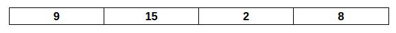
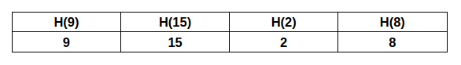
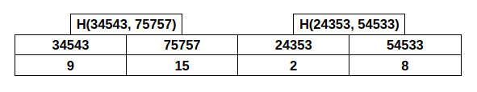
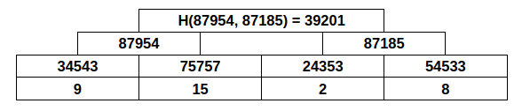
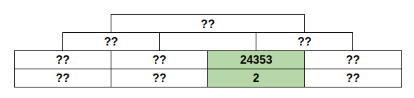
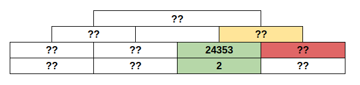
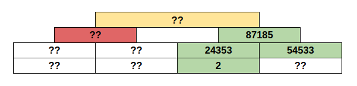
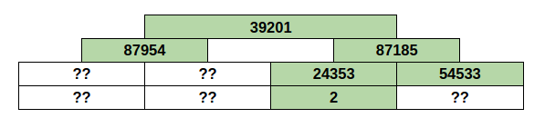
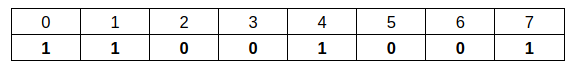

# Technical Survey of Proof of Innocence in Cardano

Proof of Innocence allows users to demonstrate anonymously that their funds did not originate from a blacklisted set of transactions. By leveraging zero-knowledge cryptography, users can construct statements about private information that can be verified by third parties. In this case, we want to prove that users' funds are not part of a specified set of unlawful transactions, without revealing the specific transaction in which the user was involved. In an increasingly scrutinized and compliant financial landscape, such a mechanism will facilitate safer participation for users who wish to uphold their privacy rights.

This technical report shows the research done before implementing a Proof of Innocence (PoI) protocol in Cardano. It first describes the problem of PoI along with some use cases. Secondly, it shows existent implementations in other blockchains. Finally, it proposes a solution in Cardano and describes the technical challenges that need to be addressed.

This is done in the context of [this proposal](https://projectcatalyst.io/funds/13/f13-cardano-use-cases-concept/zero-knowledge-proof-of-innocence-on-cardano-encoins-modulo-p-eryx) from Project Catalyst's Fund 13.

### The impact of this implementation

PoI strengthens the trustworthiness of the ecosystem, encouraging adoption from users and entities that require higher security and privacy standards. The protocol opens the door for more innovative privacy and compliance use cases. This can drive real-world utility in sectors like finance and supply chain, where privacy and trust are crucial.

However, we want to clarify that the scope of the proof of concept is limited to designing the architecture and the necessary Zero Knowledge testing. All project outputs will be publicly available, ensuring transparency and the ability for developers across the ecosystem to contribute, adapt, and build upon the solution.

By addressing the privacy concerns inherent in transparent blockchain systems, this project not only enhances the Cardano ecosystem but also positions Cardano at the forefront in balancing privacy with compliance. The Proof of Innocence proof of concept will promote greater user adoption and trust while laying the groundwork for a more flexible, privacy-enhancing infrastructure that other developers can leverage in their solutions. This will ultimately contribute to a more secure, user-friendly, and innovative Cardano community.

## How Proof of Innocence works

### What is a Proof of Innocence?

The purpose of Proof of Innocence is to prove that a user's transaction is not related to malicious activity. 

Thinking generically, there are many ways to prove innocence. In particular, when we talk about Proof of Innocence within the context of a blockchain, we're thinking about proving that a certain transaction doesn't belong to a given set of malicious transactions, which is published on-chain. We call this a *proof of exclusion*.

If the transaction ID is public, checking whether it is malicious or not is trivially done by comparing it against the whole list. However, there is a privacy problem with this approach: if you disclose the transaction (and in particular, the origin address) anyone can calculate all the balances for that account.

Some tools, like *mixers*, were created to anonimize the origin addresses of transactions, but they require a complementary compliance method to prove they are not malicious without revealing the transaction ID directly. In order to achieve this we use *zero-knowledge* proofs.

### The solution from a zero-knowledge perspective

As mentioned, the problem consists of providing a zero-knowledge proof of exclusion. The standard way of doing this in the context of zero-knowledge is with *sparse Merkle trees* (see below). A sparse Merkle tree indexes elements that both belong and do not belong to the set, indiscriminately. The leaves are elements in the set's domain. 

We can create a sparse Merkle tree from the given set of flagged transactions, and prove that the leaf indexed by the element is empty. This proof consists of a path from the element to the root of the tree. We can prove that the leaf in the tree indexed by our element is empty by building the Merkle path, using the encoding of the empty value as the initial value, and using the binary encoding for the element in question in the path indexes.

### The structure of a zero-knowledge proof

A zero-knowledge system allows one party (the prover) to convince another party (the verifier) that a particular statement is true, without revealing any additional information beyond the validity of the statement itself. This concept ensures privacy while maintaining verifiability. It guarantees correctness without exposing any sensitive information.

Zero-knowledge protocols work by converting a computational problem into a structured mathematical proof. The prover constructs a proof that can be efficiently verified and has no information about the secret data, while at the same time being infeasible to forge without knowing the correct input. This is achieved with techniques such as polynomial commitments, elliptic curve pairings, and interactive challenge-response mechanisms.

The verifier then checks the validity of the proof (in this case, a proof of exclusion from a set). The verification process is designed to be highly efficient, allowing the verifier to check correctness without needing to redo the original computation. This makes zero-knowledge proofs particularly useful for blockchain applications, privacy-preserving authentication, and scalable cryptographic protocols, where proving validity without revealing sensitive data is essential.

### Merkle trees and set representation

A Merkle Tree is a cryptographic data structure that allows one to commit to a dataset without storing the entire dataset itself. Instead of storing the database on-chain, we just store one element: the root of the Merkle tree. It is widely used in blockchain systems, where keeping a full database on-chain would be prohibitively expensive in terms of storage and computation.

Since the full database isn't available on-chain, any memory access must be accompanied by a zero-knowledge proof that the value remains unchanged since the original commitment, to ensure data integrity without requiring the verifier to store or recompute the entire dataset.

A designated entity, which has access to the full database, periodically generates a commitment to the current state of the data. This commitment is constructed by recursively hashing smaller pieces of the database, ultimately producing a single root that serves as a compact and tamper-proof representation of the entire dataset.

Imagine that a given database has size 4.

We start by hashing each of the values and storing those hashes.

Then we hash consecutive pairs together and get half the number of elements.

We repeat that same process enough times and finally get a single element, which we will call the root. This leaves us with a tree-like structure.

The database commitment is the root of its Merkle tree (in our case the number 39201).

When someone asks for the value of position 2 (indexing from zero), we'll answer 2, while also giving proof. We want to give the verifying party enough data to recalculate the root on their own without revealing all values in the database.

The verifier starts by calculating the hash value for 2.

However, the value of the right child is unknown, and we need it to calculate the next hash in the tree.

What we do as provers, then, is provide the hash value of the right child, instead of its raw data. Now, the verifier needs the hash value of the left part of the tree.

We provide the missing value so it can now calculate the root.

If the calculated root matches the committed one, the verifier is sure the database wasn't modified. This is because any modification in a leaf of the tree (any modification in the data) causes the root to change.

The prover gave the verifier the list [2, 54533, 87954]. This is called a *Merkle path*, and is proof for the validity of the queried value.

#### Sparse Merkle trees

A sparse Merkle tree is a type of Merkle tree that represents a database where both the presence and absence of elements in a set are explicitly recorded.

This is usually done to represent sets where the domain is comprised of all numbers in a specific range (256-bit numbers, for instance). For simplicity's sake, we will work with 3-bit numbers here. We want to represent the set [0,1,4,7].

We build a database with 8 slots (one for each possible 3-bit number), containing the number 1 in the indices for values that are present and a 0 for values that are not. In our case:

We use the transaction ID (or its hash) as an index of the tree and then check the value in that index to see if it is present or not.

Committing to the state of this memory is the same as committing to the contents of the set. One does not typically choose the values "0" and "1" because it allows for brute-force attacks, but the idea remains the same.

## Use case

The main use case for Proof of Innocence is in something called Mixers. The objective of mixers is to increase privacy in token flow and exchange, so they are required to be accompanied by compliance mechanisms to meet money flow regulations.

### Mixers

In a public blockchain, as the name suggests, all state information is openly accessible. Anyone can download the full ledger, which contains every transaction ever made. This means that, for any given address, one can track its balance and transaction history. This level of transparency contrasts with other payment methods. For instance, cash transactions are inherently untraceable because no centralized record exists of a specific note’s movement. Debit and credit card transactions, however, are recorded by banks, which act as trusted intermediaries responsible for safeguarding transaction data. However, most decentralized systems lack such intermediaries, making all activity fully traceable.

Mixers aim to address this lack of privacy. They function as intermediaries where users deposit assets and later withdraw them in a way that severs the link between the sender and receiver. This withdrawal allows funds to be spent without revealing the original depositor’s address, achieving financial anonymity.

While this significantly enhances privacy, it also introduces risks, particularly regarding financial crimes. If an address is known to hold illicitly obtained funds, depositing them into a mixer and withdrawing them to a fresh address can effectively erase any trace of their origin. This makes mixers an attractive tool for money laundering, as once funds leave the mixer, they can circulate freely without any clear link to their criminal past.

Proof of Innocence offers a solution by enabling users to prove that their transaction is not associated with a known list of illicit activities. This is achieved through trusted oracles or authorities that maintain and update lists of flagged transactions. By integrating these proofs, mixers can ensure that the assets they process are not tied to criminal activity, thereby enhancing their legitimacy without sacrificing privacy.

The exact implementation of such protections varies depending on the mixer design and the underlying blockchain architecture, but the core concept remains consistent across different mixer use cases.

### The scope of the protocol

The scope of such a protocol, exemplified in the use case of mixers, is described by the following pipeline.

1. Relevant authorities (e.g. US's [OFAC](https://ofac.treasury.gov/)) emit lists with addresses or transactions that are sanctioned, or flagged as illicit. They aim to prohibit people from dealing with money originating from addresses or transactions in these *blacklists*.
2. Users who take an interest in demonstrating the legitimacy of their money's origin use our protocol to prove that it does not come from flagged addresses or transactions. They may also restrict the flow of their money to systems that use our protocol.
3. If any doubt arises regarding their money's origin, they have the "proof of innocence" given by our protocol.

Note that the authorities are passive agents in the system. They do not actively interact with it. The users are just taking preventive action to avoid handling money from already known illicit origins, which would be reason enough for these authorities to prosecute them. Only if suspicion or doubts arise do authorities get actively involved.

## Existing implementations and other solutions

When presenting a solution applicable to Cardano, it is essential to consider other solutions that have already been implemented on different blockchains. While a solution cannot simply be copied and pasted from one blockchain to another, there are numerous parallels that can help shape both the structure and implementation of the proposed solution.

The aforementioned importance of preventing the misuse of privacy-enhancing mechanisms on the blockchain as a vehicle for illicit activities has led to Proof of Innocence implementations being developed over the years, following the emergence of solutions like Tornado Cash and Railgun Examples include [Chainway's PoI](https://proofofinnocence.com/) and [PPoI Railgun](https://docs.railgun.org/wiki/assurance/private-proofs-of-innocence). Additionally, similar solutions have been implemented on Starknet in early 2025.

### Case study: Railgun
Quoting [Railgun's website](https://https://railgun.ch/#/):

> RAILGUN is a smart contract for professional traders and DeFi users that adds privacy protection to cryptocurrency transactions.
> 
> When using the RAILGUN Privacy System, wallet addresses are removed from transactions on open-ledger blockchains. Without RAILGUN, wallet addresses are revealed and recorded on the blockchain. If a wallet address has been recorded in a transaction, anyone can then check that wallet’s history using tools like Etherscan. This is similar to a person having their bank balance and spending history revealed whenever they use a debit card. RAILGUN is the solution to this problem.

That is a summary of the Railgun concept, but we can break down its implementation into two main parts. On one side, we have the core components that form Railgun's codebase: the smart contracts that run on Ethereum, the circuits responsible for generating zero-knowledge proofs for private transactions, and the circuits used to create Proof of Innocence proofs. These repositories can be found under [Railgun-Privacy](https://github.com/Railgun-Privacy).

On the other side, we have access to the development efforts that work as the framework for the tool. These are located in the [Railgun-Community](https://github.com/Railgun-Community/) repositories. Here, you'll find libraries for interacting with smart contracts using JavaScript, as well as SDKs for integrating with a Railgun wallet. While this is essentially just a toolkit, it's through these tools that most Railgun integrations happen, and that is where PoI comes into play.

The Railgun-Community repo also includes the development of Private Proofs of Innocence, which you can check out in its [documentation](https://docs.railgun.org/wiki/assurance/private-proofs-of-innocence) and [repository](https://github.com/Railgun-Community/private-proof-of-innocence/tree/main). This tool, deployed to nodes, is responsible for validating each zero-knowledge proof generated for PoI, enabling it to work with the Railgun flow in a decentralized way.

PoI proof generation happens off-chain. Let’s take a closer look at how this works by examining Railgun’s [engine](https://github.com/Railgun-Community/engine/tree/main). Within the [prover](https://github.com/Railgun-Community/engine/blob/main/src/prover/prover.ts) file, the `provePOI` method is the one that kicks off proof generation. This method takes in the circuit inputs (including the Merkle tree root and the transaction to be validated) along with the blinded commitments related to the UTXOs used in the transaction and the new ones generated afterward.

Inside `provePOI`, the compiled circuits are retrieved and executed, generating a zero-knowledge proof using the Groth16 algorithm. The proof is then validated to ensure it hasn't resulted in an unusable Proof of Innocence. Once validated, it gets submitted to a PPoI node.

Now, let’s go over the [circuits](https://github.com/Railgun-Privacy/circuits-ppoi/blob/main/circuits/poi-transaction.circom) used to execute the proof. There are two public inputs used for verification: `poiMerkleroots`, which represents the Merkle roots of the PoI trees that contain commitments to previously spent UTXOs, and `anyRailgunTxidMerklerootAfterTransaction`, which is the Merkle root of the Railgun transaction tree after the transaction being verified has been included. Through Circom, two checks are made: on one hand, it ensures that the transaction is valid within Railgun's internal transaction system; on the other hand, it verifies the innocence of the original transaction. If both checks are true, the circuit validates the input.

The values in the sparse Merkle tree memory (representing the set) are obfuscated to introduce entropy and prevent chunks of the tree from looking exactly like others, which would enable brute-force attacks.

With all this in mind, we can draw some conclusions. Railgun’s PoI circuits are coupled with its overall solution. This means that when the proof is generated, it is directly linked to a transaction and other values closely tied to the operation of Railgun’s smart contracts. This has an advantage: it prevents a situation where the proof is incorrectly linked to the wrong transaction. However, it also creates a dependency between PoI and its specific use case. As a result, the solution can’t be easily ported to another context without significant modifications.

Railgun is a case study that offered us valuable insights for implementing a Proof of Innocence solution for Cardano. The key challenge, however, is the coupling between PoI proofs and Railgun transactions. Adapting it for Cardano would require rethinking much of the circuit's design to remove Railgun-specific elements. That said, it still serves as a solid foundation for exploring new ideas.

### Case study: Spillways

Spillways is a decentralized protocol for private transactions on the Ethereum blockchain. They [claim](https://spillways.gitbook.io/documentation/protocol/proof-of-innocence) to implement proof of innocence, but we found no evidence of that in the several repositories they made public.

### Case study: Privacy Pools

This seems to be an experimental project from [0xbow](https://www.0xbow.io/asp) to make a "Tornado Cash with Compliance" (this is, with zero-knowledge proofs of inclusion or exclusion to good or bad transaction or address sets).

[This](https://github.com/ameensol/privacy-pools) is the Privacy Pools repo.

#### Chainway for Tornado Cash
Privacy Pools is an iteration of Tornado Cash, a mixer that originally did not have a PoI mechanism. Currently, Tornado Cash is banned in the USA because of its usage for money laundering. Chainway attempted to add a compliance mechanism to it (before Privacy Pools), so we included it as a part of the PoI implementation ecosystem.

For that reason, we summarize the solution provided in [this repository](https://github.com/chainwayxyz/proof-of-innocence/tree/main/app/src), which is Chainway's original implementation of PoI for Tornado Cash.

The application has one Circom circuit called `Withdraw`, which verifies both the PoI condition and other domain logic conditions. This means that when a user intends to withdraw from TornadoCash, part of that circuit logic verifies the PoI at that point. It takes the blacklist root as public input and the corresponding Merkle path and indices as private inputs.

*The number that's assigned as a value to the leaf input wire of the component is the constant that indicates that said leaf is empty:
>21663839004416932945382355908790599225266501822907911457504978515578255421292

As the PoI verification logic is embedded in the same circuit that verifies the withdrawal as a whole, no additional conditions are needed to link the PoI results to the rest of the proof.

#### The Privacy Pools implementation

The product currently has a system to update good and bad subsets of transaction IDs or addresses, and an on-chain verification that can be found in [this link](https://github.com/ameensol/privacy-pools/blob/main/circuits/tornado_rescue.circom) (notice that the file is called `tornado_rescue`). We think that the function in line 14 of [this file](https://github.com/ameensol/privacy-pools/blob/main/circuits/verifier_templates/withdraw_from_subset_verifier_template.sol) contains code that is very similar to what we need, only in Solidity.

In line 77 of [this file](https://github.com/ameensol/privacy-pools/blob/main/contracts/PrivacyPool.sol), we found a usage of the verifying function, in the context of a withdrawal. This means the proof is provided and verified when the withdrawal is made.

## How PoI could work on Cardano

In addition to the theoretical aspects of a PoI solution for a blockchain, there are some implementation issues that are particular to Cardano.

These come from different sources:
* Cardano has limited computational power, in computational and storage units, and some proving systems have proof sizes that might be too large. 
* Not all primitives are implemented. Even with the recent advances in the cryptographic primitives that were included in recent versions of Aiken and Plutus, there's still work to do, and this means that some approaches will be more straightforward to implement than others. 
* Cardano uses the UTxO model, and most of the current implementations of PoI are on Ethereum, where the Accounts model is used. This too calls for some adaptations.

In the first part of the section, we discuss the criteria for the selection of a proving system in particular, according to the aforementioned limitations.

Then, in the same spirit, we present two possible architectures that take different approaches, to be used as inspiration for an actual implementation (according to each project's needs).

Finally, we present some implementation challenges or issues that one might encounter when designing a solution that is specific to Cardano, in order to help with the ramp-up of a new implementation.

### Choosing a proving system

We think that Groth16 is a good choice for a proving system, considering the following criteria:

**1. Efficiency:** 

The Groth16 proving system is one of the most efficient zkSNARK protocols available today. Other existing proving systems, such as Plonk, Marlin, Sonic, etc., often involve a higher verification burden or produce larger proof sizes. This efficiency is a significant advantage, considering the particularly restrictive computational resource limits in Cardano that could make some Proof of Innocence implementations unfeasible.  

- As evidence of this, [our experience has shown](https://github.com/Modulo-P/ak-381) that a single verification of a proof using the Groth16 protocol can consume up to **a third of Cardano's computational budget** for a transaction. The use of other proving systems could further increase this load.  
- What's more, we know a Groth16 proof using the BLS12-381 curve is about ~192 bytes. This lets us work comfortably within Cardano's memory usage limitations.
- Since Groth16 uses elliptice curves, we are also leveraging BLS12-381, a curve [already supported by Cardano](https://cips.cardano.org/cip/CIP-0381).

Additionally, it is important to emphasize that our vision is to make our solution easy to integrate. Therefore, we opted for a **plug-in approach**, meaning that services requiring Proof of Innocence will be able to invoke the verifier contract in an accessible manner within the same transaction. This implies that the transaction must support the execution of the service and the verifier contract for Proof of Innocence. Consequently, the PoI verifier contract must not overload or bottleneck the execution of the service that requires it. This also results in a need for lower transaction costs.

**2. Practicality**

Groth16 comes with the trade-off of requiring a trusted setup, meaning that a multi-party computation (MPC) process must be carried out to ensure its secure use. This process involves the cooperation of multiple parties to be successfully executed. Normally, this adds an extra layer of complexity when pushing projects that rely on Groth16 into production. However, since this is merely at the proof of concept stage and not intended for production, the trusted setup can be bypassed.

Moreover, we already had an implementation of the Groth16 verifier, so it was practical to use this proving system since we know it works and have experience with it.

### Architecture of the solution

There are many possible architectures for this implementation. We present two of them:

1. The first one is a decoupled version of the Proof of Innocence protocol, which works as a standalone validator.
2. The second one is a circuit that each use case has to import as a software library.

#### Decoupled architecture

With this architecture, the solution would be implemented as a validator that any code can reference to verify whether a given transaction is banned.

It consists of a *validator* (smart contract) that a transaction can call as a *reference input UTxO*, acting as a verifier for the Proof of Innocence protocol. The required proof will be built by an off-chain prover.

The prover will generate a Groth16 proof with the following inputs:
- Public
    - The root (**r**) of the sparse Merkle tree containing the set of forbidden transactions.
    - The hash (**h(txid)**) of the transaction ID.
- Private
    - The transaction ID (**txid**).

Using the Merkle tree, the generated proof represents the following statement:

> The prover knows a transaction ID (**txid**) that hashes to **h(txid)** and does not belong to the set of transactions identified by the root **r**.

The on-chain verifier receives the public inputs and the proof from the redeemer. It also requires the verification key, but since this key depends not on a specific verification instance but on the general circuit, it can be provided in the datum of a reference input.

This solution in particular needs the hash of the transaction ID as a public input in addition to the txid as a private one because you need a way to assert that the txid used in the standalone proof is equal to the one that's used in the domain logic of each particular dApp. This is best explained in the challenges section, under the title *"Linking the proven unflagged transaction ID with the one used in the application"*.

In particular, there's a security issue with using the hash as-is, which is discussed (along with a possible solution) in section *"Solving the brute force attack on the transaction ID hash"*.

#### Library architecture

This solution consists of a circuit component that any *dApp* developer can import into their code as a library. This approach is closer to examples found on Ethereum but comes with the drawback that it requires the developer to implement the circuit in the same language as the PoI library.

We'll describe this solution using Circom terminology, but this does not imply that the circuit must be implemented in Circom.

First, we define a fixed constant, FALSE, to indicate that a value at a given position is not part of the set (refer to the sparse Merkle tree section above for more details). Similarly, we define another constant, TRUE, for elements that belong to the set.

The height of the Merkle tree must be chosen such that it can accommodate any possible **txid**. If the height is **x**, then numbers up to **x** bits in length can be represented, meaning the tree can store up to $2^x$ elements.

The circuit component will have the following input signals:
- The transaction ID (**txid**).
- The root **r** of the tree.
- The Merkle path (a list of hashes for each level).
- Optionally, a list of indices corresponding to the Merkle path, indicating whether each value is a left or right child. If this is not provided, it can be computed from the binary representation of the **txid**.

The statement proven by this component is as follows:

>The prover knows a transaction ID (**txid**) and a Merkle path that reconstructs the root **r** of the tree, assuming that the element in the **txid**-th memory index is FALSE.

### Technical challenges

This section describes challenges we found relevant enough to mention and aspects of the solution that can be approached in different ways.

#### Linking the proven unflagged transaction ID with the one used in the application 

The main challenge in making this a standalone circuit (following the aforementioned decoupled architecture) is that the proof of innocence (PoI) only establishes the following statement:

> I have knowledge of a private **txid** that is not in this public list of **txid**s.

However, this does not inherently link the proven transaction ID to the rest of the application code. The proof could refer to any $txid$, not necessarily the one involved in the transaction being validated. An additional mechanism is required to establish this connection.

To address this, we propose selecting a hash function and including the hashed **txid** as a public input to the PoI. This modifies the proven statement to:

> I know a private **txid** that is not in this public list of **txid**s and that hashes to this public value **h(txid)**.
 
Then, in the rest of the application, ensuring the correct transaction ID is used becomes straightforward—one only needs to check that the provided **txid** hashes to the publicly committed **h(txid)**.

While this solution establishes the necessary link, it introduces a privacy flaw, which we examine in the next section.

##### Solving the brute force attack on the Transaction ID hash

The privacy issue arises from the fact that the hash of the transaction ID must be made public to establish a link between both statements. If an external observer has access to the list of all transaction IDs that deposited funds into a mixer, they could simply hash each one and search the results for a match with the public hash. If it's found, they could determine which input transaction corresponds to a specific output transaction, effectively breaking the mixer's anonymity.

A well-known way to mitigate this attack is to prevent the transaction ID from being hashed in isolation. Instead, it's concatenated with a randomly chosen number before being hashed. This number, commonly referred to as *salt*, introduces additional randomness, making brute-force attacks significantly more difficult. The salt remains private since it is included in the proof but kept as a secret input.

With this approach, the proven statement changes to:

> I have knowledge of a private transaction ID **txid** and a secret salt number **s**, such that **txid** is not in this public **txid**s list.
And that **txid $\oplus$ s** hashes to this public value **h(txid $\oplus$ s)**.

#### Inline script or script sent in the transaction

There are two ways of accessing the script code of the validator in a Cardano transaction. One is to send the validator code as a function inside the transaction code, and the other is to inline it in the validator of a reference input and tell our actual transaction to reference it (in this way, the reference input's validator works as a precondition to the actual transaction's validator).

We opted for the inline approach because it eliminates the need for users to import the script code manually. By inlining the validator, transactions referencing it can verify proofs without requiring additional code dependencies.

#### One-step or two-step verification

There are two possible approaches for verifying the proof within a transaction. The first option is to have a single transaction that directly references the proof validation code and provides the necessary inputs for verification. The second approach involves a two-step process: one transaction mints a token upon successful proof verification, and a later transaction uses this token as proof of verification.

We opted for the single-step approach because it is simpler to implement and ensures that the verification happens as close as possible to the actual usage. This minimizes the risk of using outdated transaction databases.

#### Modular or monolithic approach

There are two approaches to integrating PoI into another existing protocol.

The first one is the modular approach. This means an existing protocol (e.g. a mixer) calls the PoI smart contract as a complement. We call it modular because the smart contract handling PoI is separate from the contracts managing the service. The key advantage of this approach is its ease of integration: the service requiring PoI only needs to verify that a specific output from the PoI contract has been spent. If the PoI contract is audited, its logic can be leveraged without relying on the service contract. However, the main drawback is that this approach requires verifying two zero-knowledge proofs on a single transaction: one for the service logic and another for PoI. This additional computation increases the load in the transaction, potentially restricting service contract execution and leading to higher fees.

The second one is the monolithic approach (just like Railgun). It involves embedding the PoI logic directly into the service's logic, meaning the PoI circuit is integrated into the service circuit, and the smart contract verifies a single zero-knowledge proof. The main advantage of this approach is efficiency. It requires verifying only one proof, reducing resource consumption and transaction fees. However, the main drawback is its complexity. Integrating the PoI circuit into the service circuit is a bigger challenge than the modular approach, making this one less straightforward to implement.

#### Blockchain limitations

The verification of zero-knowledge proofs often imposes a significant burden on blockchain networks. It is crucial to consider the potential impact on the Cardano network, as such assessment will serve as a guide for any application aiming to incorporate the Proof of Innocence protocol. In this regard, it is important to highlight the following limitations and resource constraints of the Cardano network:

##### Storage

The maximum size for each transaction is 16 kilobytes (precisely 16,384 bytes). This limit encompasses the script size, the transaction body (including its inputs and outputs), as well as any associated metadata. Based on the considerations outlined in the "Solution" section, specific data must be included in a transaction executing a Proof of Innocence (PoI). This allows us to make an estimation.

The required data for a transaction to execute a PoI would approximately include the following.

- The proof itself - consisting of two elements in G1 and one in G2, totaling **192 bytes**. It is important to note that the size of the Groth16 proof is constant.
- The public values of the proof in the PoI protocol - including the root hash of the tree, the transaction ID hash, and a constant element representing null values. Assuming a **256-bit hash algorithm**, this would add **96 bytes** to the transaction.
- Finally, the **verification key** consists of **three elements in G1 and four in G2**, resulting in **528 bytes**.

Adding up these values, the total required data amounts to approximately **816 bytes**, which is only **4.98% of the maximum transaction size**. Storage does not seem to be a limitation at all.

*Note: A G1 element occupies 48 bytes in its uncompressed form, while a G2 element occupies 96 bytes in its uncompressed form. Aiken does not yet facilitate a way of working with compressed G1 or G2 elements.*

##### Computation

In Cardano, each transaction has a maximum execution budget.

- **CPU usage** - The number of computational steps a script performs is measured in Execution Units, where each step represents 1 picosecond of execution time on a benchmark machine. The per-transaction limit is approximately 10,000,000,000 Execution Units (10 ms).
- **Memory usage** - Each Memory Unit corresponds to the number of bytes allocated in memory during execution. The per-transaction limit is approximately 14,000,000 Memory Units.

At this stage, the exact execution cost of verifying a Proof of Innocence remains uncertain. However, we can provide some context based on prior benchmarks. In previous tests, we evaluated zero-knowledge proof verification for at least two different circuits. The table below presents the benchmark results for both:

| Test Name           | Memory (mem) | CPU Cycles (cpu) |
| ------------------- | ------------ | ---------------- |
| groth_verify_pass_1 | 35961        | 2136202327       |
| groth_verify_fail_1 | 35961        | 2136202327       |
| groth_verify_pass_2 | 35961        | 2136202327       |
| groth_verify_fail_2 | 35961        | 2136202327       |
| groth_verify_pass_3 | 35961        | 2136202327       |
| groth_verify_fail_3 | 35961        | 2136202327       |
| groth_verify_pass_4 | 65421        | 2926604521       |
| groth_verify_fail_4 | 65421        | 2926604521       |
| groth_verify_pass_5 | 65421        | 2926604521       |
| groth_verify_fail_5 | 65421        | 2926604521       |
| groth_verify_pass_6 | 65421        | 2926604521       |
| groth_verify_fail_6 | 65421        | 2926577917       |
| groth_verify_pass_7 | 65421        | 2926604521       |
| groth_verify_fail_7 | 65421        | 2926560181       |

*Note: These tests are present in the [ak-381 library](https://github.com/Modulo-P/ak-381).*

Analyzing the data from tests 4 to 7, which correspond to the largest circuit, we observe that zero-knowledge proof verification places a significantly higher load on CPU units compared to memory units. In fact, CPU usage is much closer to the transaction limit, whereas memory consumption remains far from it. This suggests that the primary bottleneck will be CPU execution, while memory constraints are unlikely to pose a problem.

By calculating the percentage of CPU units required to verify the largest circuit relative to the limit, we find that verification consumes approximately **29%** of the total CPU budget. This implies that, at most, three zero-knowledge Groth16 proofs can be verified within a single transaction. Since the verification is constant in terms of computational complexity, we should not expect the real number to differ too much from this.

As a preliminary estimate, we expect that verifying a Proof of Innocence (PoI) will not significantly impact transaction execution. While the precise execution cost will only be determined during the project's development, our initial assessment suggests that running a PoI verification on the Cardano mainnet is feasible.

#### Solving a possible race attack

The protocol relies on a trusted oracle that frequently updates a set of blacklisted transactions or wallets on-chain. To function effectively, the oracle must promptly detect fraudulent activity and update the blacklist promptly. Typically, this set consists of transaction IDs or wallet addresses associated with illicit activities.

A potential vulnerability in a naive implementation of this protocol is the risk of an attacker exploiting the delay between an illicit transaction and the oracle’s update. Specifically, an attacker could quickly move tainted funds to a new address or generate a fresh transaction ID before the oracle records the initial malicious activity. By doing so, they could bypass the Proof of Innocence mechanism, as the blacklist would not yet include the new transaction or address, allowing illicit funds to be withdrawn undetected. This creates a race between the attacker's ability to generate new, untracked transactions and the oracle’s update frequency.

Beyond the timing challenge, maintaining an up-to-date blacklist on-chain introduces a significant economic burden. Since each update requires an on-chain transaction, frequent updates would lead to high gas costs for the oracle. This financial constraint benefits attackers by making it costly for the oracle to keep pace with rapidly shifting illicit activity.

One way to mitigate this risk is by introducing a **time delay mechanism** within the mixer protocol. This would provide the oracle with a buffer period to detect and blacklist illicit transactions before they can be exploited.

A delay can be implemented in two ways:

1. **At the deposit stage:** The mixer could enforce a waiting period before accepting a deposit. If a transaction was recently involved in another transfer, it would be temporarily restricted from entering the mixer, reducing the attacker's ability to instantly obfuscate illicit funds.
2. **At the withdrawal stage:** The zero-knowledge proof could incorporate a time-based verification mechanism requiring a secret timestamp. This would ensure that a withdrawal can only occur after a delay period longer than the oracle’s update frequency, preventing immediate laundering of newly deposited illicit funds.

Additionally, strengthening the oracle’s tracking capabilities is crucial. A highly responsive system that detects and reports illicit transactions in near real-time would minimize the attack window, making it significantly harder for adversaries to exploit delays in the blacklist update process.

## Ending note

This document discusses the possible paths to take when implementing PoI for Cardano, according to our research. We summarized a few examples from other blockchains and, with that, we proposed two approaches for the implementation. Finally, we discussed some implementation challenges regarding the different aspects of the solution. We think this document will be a solid base on which to build a future implementation of PoI according to different product needs.
